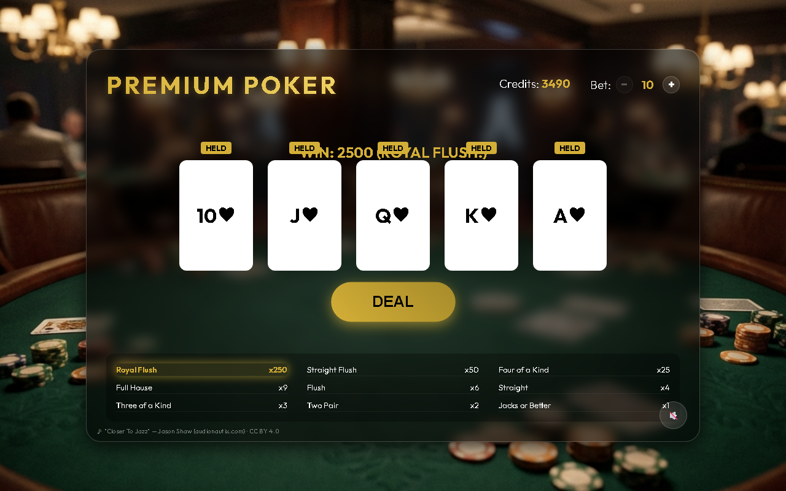

# 🎰 Premium Poker

> グラスモーフィズム調のUIで遊べる、ブラウザ完結型のビデオポーカー（Jacks or Better）ゲーム。
> インストール不要・依存ライブラリなし。`index.html` を開くだけで動きます。



---

## ✨ 特徴

- 🃏 **本格的なビデオポーカー** — Jacks or Better ルール（A-2-3-4-5 のローストレートにも対応）
- 💰 **ベット調整** — 10〜100 まで 10 刻みで変更可能（所持金を超える額は賭けられません）
- 🎯 **配当表ハイライト** — 役が成立すると、対応する配当行が金色に光って演出
- 🔁 **引き直しアニメーション** — ホールドしていないカードだけが再フリップ
- 🎵 **BGM** — ローカル同梱のジャズ（オフラインでも再生可能、ON/OFF切替）
- 💎 **モダンUI** — グラスモーフィズム＋3Dカードフリップ＋背景ブラー
- 📦 **依存ゼロ** — Vanilla HTML / CSS / JavaScript のみ。ビルド工程なし

---

## 🚀 導入方法

### 方法1: そのまま開く（最も簡単）

1. このリポジトリを [ダウンロード](https://github.com/sawahotaru/premium-poker) または `git clone`
   ```bash
   git clone https://github.com/sawahotaru/premium-poker.git
   ```
2. フォルダ内の `index.html` をブラウザでダブルクリックして開く

> ⚠️ 一部のブラウザは `file://` で音声の自動再生を制限する場合があります。
> その場合は下記の「ローカルサーバーで開く」方法を推奨します。

### 方法2: ローカルサーバーで開く（推奨）

Python が入っていれば、フォルダ内で以下を実行：

```bash
# Python 3
python -m http.server 8000
```

ブラウザで `http://localhost:8000` を開く。

### 方法3: GitHub Pages で公開

リポジトリの **Settings → Pages** で公開ブランチを指定するだけで、
`https://sawahotaru.github.io/premium-poker/` から誰でも遊べるようになります。

---

## 🎮 遊び方

1. **BET** — 画面右上の `−` / `+` でベット額を調整（初期値10）
2. **DEAL** — ボタンを押すとベット分が引かれ、カードが5枚配られます
3. **HOLD** — 残したいカードをクリック（「HELD」表示が出ます）
4. **DRAW** — もう一度ボタンを押すと、ホールドしていないカードが引き直されます
5. **判定** — 成立した役に応じて配当が支払われます
6. クレジットが10未満になると **GAME OVER**。`PLAY AGAIN` でリスタート

初期クレジットは **1000** です。

---

## 💵 配当表（ペイアウト）

配当 = **ベット額 × 倍率**

| 役 | 倍率 | 説明 |
|---|---|---|
| **Royal Flush** | ×250 | 同じスートの 10・J・Q・K・A |
| **Straight Flush** | ×50 | 同じスートの連続した5枚 |
| **Four of a Kind** | ×25 | 同じ数字4枚 |
| **Full House** | ×9 | スリーカード＋ワンペア |
| **Flush** | ×6 | 同じスート5枚 |
| **Straight** | ×4 | 連続した5枚（スートは不問） |
| **Three of a Kind** | ×3 | 同じ数字3枚 |
| **Two Pair** | ×2 | ペアを2組 |
| **Jacks or Better** | ×1 | J・Q・K・A いずれかのワンペア |

> 💡 **Jacks or Better** が最低役です。10以下のペアでは配当が付きません（本場のビデオポーカーと同じルール）。
> A-2-3-4-5 の「ローストレート」も Straight として成立します。

---

## 🗂️ ファイル構成

```
premium-poker/
├── index.html          # ゲーム画面の構造
├── style.css           # スタイル（UI・アニメーション）
├── script.js           # ゲームロジック
├── CREDITS.md          # 素材クレジット
├── README.md           # このファイル
└── assets/
    ├── bg.png          # 背景画像
    ├── bgm.mp3         # BGM（ジャズ）
    └── screenshot.png  # README用スクリーンショット
```

---

## 🛠️ 技術スタック

- **HTML5** / **CSS3**（Flexbox・Grid・3D Transform・backdrop-filter）
- **Vanilla JavaScript**（フレームワーク・ビルドツール不要）
- フォント: [Outfit](https://fonts.google.com/specimen/Outfit)（Google Fonts）

---

## 📜 ライセンス / クレジット

- **ソースコード**: MIT License（自由に利用・改変・再配布できます）
- **BGM**: 「Closer To Jazz」by **Jason Shaw**（[audionautix.com](https://audionautix.com/)）
  / [CC BY 4.0](https://creativecommons.org/licenses/by/4.0/) — 商用利用可・要クレジット
- 素材の詳細は [CREDITS.md](CREDITS.md) を参照してください。

> ℹ️ 背景画像 `assets/bg.png` を再配布・商用利用する場合は、取得元のライセンスをご確認ください。

---

## 🤝 コントリビュート

バグ報告・機能提案は Issue または Pull Request でお気軽にどうぞ。

楽しんでいただけたら ⭐ Star をいただけると励みになります！
